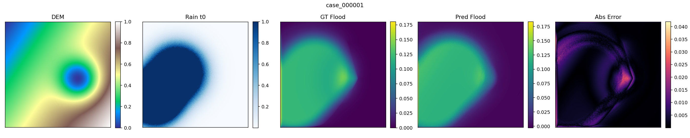
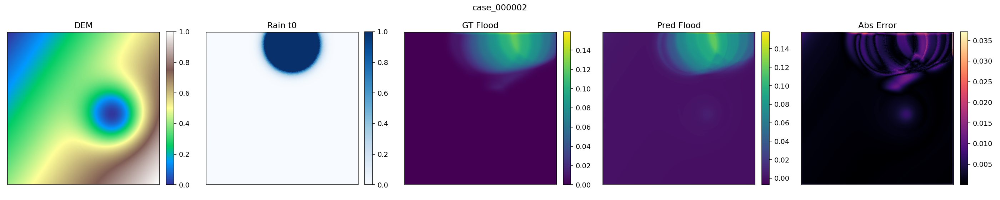
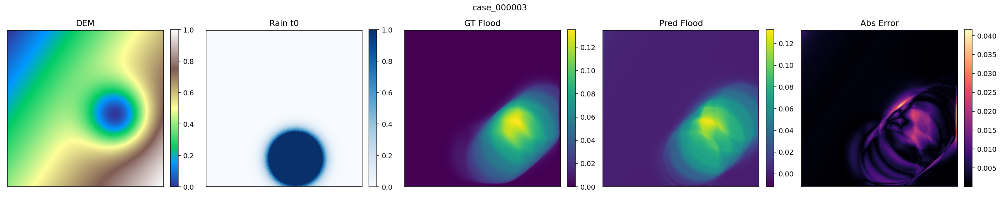

# 🌊 TwinMind-Disaster

## AI Digital Twin for Terrain-Aware Flood Prediction

TwinMind-Disaster is a working prototype demonstrating how **terrain elevation (DEM) + rainfall simulation + deep learning** can generate **AI-predicted flood depth maps**.

The project explores the concept of an **AI Digital Twin for disaster prediction**, where terrain information and environmental simulation are combined with machine learning to estimate flood risk before sensors detect it.

Project Demo
[https://gang0-jpg.github.io/TwinMind-Disaster/](https://gang0-jpg.github.io/TwinMind-Disaster/)

GitHub Repository
[https://github.com/gang0-jpg/TwinMind-Disaster](https://github.com/gang0-jpg/TwinMind-Disaster)

---

## What This Project Demonstrates

TwinMind-Disaster implements the following pipeline

Terrain elevation (DEM)
↓
Rainfall simulation
↓
Deep learning flood prediction (U-Net)
↓
Flood risk visualization

The model learns the relationship between **terrain shape and rainfall patterns** to predict **flood depth maps**.

---

## Example Results

The trained model produces terrain-aware flood prediction maps.

Each prediction visualization shows

1. terrain elevation (DEM)
2. rainfall input
3. ground truth flood simulation
4. AI predicted flood depth
5. prediction error

These results demonstrate that **TwinMind-Disaster is a working terrain-aware flood prediction pipeline**.

---

## System Architecture

The prototype integrates terrain data, rainfall simulation and deep learning.

Terrain data
↓
Terrain processing
↓
Deep learning model (U-Net)
↓
Flood depth prediction
↓
Digital twin visualization

This architecture demonstrates how terrain understanding can be integrated with AI to simulate disaster impact.

---

## Dashboard

The prototype dashboard visualizes

• terrain elevation
• predicted flood areas
• model uncertainty
• digital twin terrain map

Run locally

streamlit run ui/twinmind_dashboard.py

---

## Key Components

### Terrain Processing

Terrain elevation data is processed from DEM.

Processing pipeline

DEM XML
↓
NumPy grid conversion
↓
DEM mosaic
↓
Resize to 64×64
↓
Training dataset

Generated datasets

data/dem_npy_grid
dem_for_training.npy
slope_for_training.npy

---

### Flood Prediction Model

Model architecture
Small U-Net

Input channels

DEM terrain elevation
rainfall time series (6 timesteps)

Total input

DEM + Rain(6) = 7 channels

Output

Flood depth map

Training script

scripts/train_unet.py

---

### Experiment Tracking

Experiments are tracked using MLflow.

Run MLflow UI

mlflow ui

Open in browser

[http://localhost:5000](http://localhost:5000)

---

## Project Structure

TwinMind-Disaster

data
scripts
twinmind_disaster
ui
docs
mlruns
runs
README.md
requirements.txt

---

## Installation

Clone repository

git clone [https://github.com/gang0-jpg/TwinMind-Disaster.git](https://github.com/gang0-jpg/TwinMind-Disaster.git)
cd TwinMind-Disaster

Install dependencies

pip install -r requirements.txt

Main dependencies

numpy
torch
mlflow
streamlit
matplotlib
scipy

---

## Training

Run training

python scripts/train_unet.py --data_dir data/cases --epochs 10 --batch_size 4

Training results are automatically logged in MLflow.

---

## Data Source

Terrain data is provided by

Geospatial Information Authority of Japan (GSI)
[https://www.gsi.go.jp/kiban/](https://www.gsi.go.jp/kiban/)

Dataset

Basic Map Information DEM

Note: DEM data is **not included in this repository**.

---

## TwinMind Vision

TwinMind aims to become a

Reality Operating System for Earth

A platform where AI continuously learns from

terrain
climate
sensor networks

to

predict disasters
simulate environmental change
optimize observation networks

---

## License

MIT License

Copyright (c) 2024-2026 Zenji Oka

---

## Author

Zenji Oka
Creator of TwinMind

GitHub
[https://github.com/gang0-jpg](https://github.com/gang0-jpg)

---

Predicting water, protecting life. 🌊
