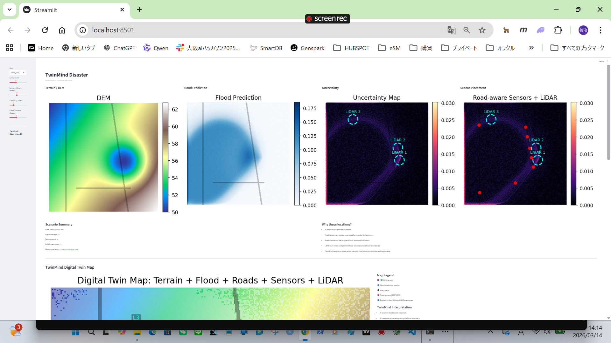
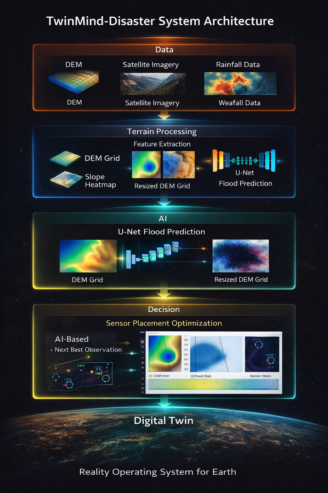

# 🌊 TwinMind-Disaster

**AI Digital Twin for Terrain-Aware Flood Prediction**




---

# TL;DR

**TwinMind-Disaster** is a research prototype showing how **AI Digital Twin technology can integrate terrain data and deep learning to predict floods and optimize observation networks.**

The system combines:

- DEM terrain data
- deep learning flood prediction
- uncertainty estimation
- sensor placement optimization
- digital twin visualization

This repository represents an **early prototype of the broader TwinMind concept:**

> **AI does not only analyze the world.  
> It decides where the world should be observed next.**

---

# 🌐 Demo

Project Website

https://gang0-jpg.github.io/TwinMind-Disaster/

GitHub Repository

https://github.com/gang0-jpg/TwinMind-Disaster

---

# 🧠 Research Motivation

Flood monitoring systems traditionally rely on:

- fixed sensor networks
- manually designed observation systems
- reactive disaster monitoring

However, disasters evolve dynamically.

TwinMind explores a new paradigm:

**AI-driven observation systems.**

By combining terrain understanding and machine learning, the system aims to create **adaptive observation networks** that improve disaster prediction over time.

---

# 🏗 System Architecture



TwinMind-Disaster integrates:

- 🗺 Terrain data (DEM)
- 🤖 Deep learning flood prediction (U-Net)
- 📊 Flood risk estimation
- 📡 Sensor placement optimization
- 🖥 Digital Twin visualization

The architecture demonstrates how **AI can integrate terrain understanding with observation planning**.

---

# 🔄 System Flow

DEM Terrain Data  
↓  
Terrain Processing  
↓  
U-Net Flood Prediction  
↓  
Risk Estimation  
↓  
Sensor Placement Optimization  
↓  
Digital Twin Dashboard  

---

# 🖥 Dashboard

The prototype dashboard visualizes:

- terrain elevation
- predicted flood areas
- model uncertainty
- road-aware sensor placement
- LiDAR observation zones
- digital twin terrain map

Run locally:

```bash
streamlit run ui/twinmind_dashboard.py
```

---

# ✨ Features

## Terrain Processing

Terrain elevation data is processed from **GSI DEM XML files**.

Pipeline

DEM XML  
↓  
Grid conversion (NumPy)  
↓  
DEM mosaic  
↓  
Resize to 64×64  
↓  
Training dataset  

Generated datasets

```
data/dem_npy_grid/
├─ dem_for_training.npy
└─ slope_for_training.npy
```

---

## Flood Prediction Model

Prototype model: **Small U-Net**

Architecture

```
Conv2d(1,16)
Conv2d(16,16)
Conv2d(16,1)
```

Input

- DEM
- slope

Training script

```
scripts/train_unet.py
```

---

## Experiment Tracking

Experiments are tracked with **MLflow**.

Run MLflow UI

```bash
mlflow ui
```

Open

```
http://localhost:5000
```

---

# 📁 Project Structure

```
TwinMind-Disaster
│
├─ data
│  ├─ raw_dem
│  ├─ dem_xml
│  └─ dem_npy_grid
│
├─ scripts
│  ├─ dem_xml_to_grid_npy.py
│  ├─ mosaic_dem.py
│  ├─ resize_dem.py
│  ├─ make_slope.py
│  └─ train_unet.py
│
├─ twinmind_disaster
│
├─ ui
│  └─ twinmind_dashboard.py
│
├─ docs
│  ├─ index.html
│  ├─ architecture.png
│  └─ dashboard.png
│
├─ mlruns
│
├─ README.md
├─ requirements.txt
└─ .gitignore
```

---

# ⚙️ Installation

Clone repository

```bash
git clone https://github.com/gang0-jpg/TwinMind-Disaster.git
cd TwinMind-Disaster
```

Install dependencies

```bash
pip install -r requirements.txt
```

Example requirements

```
numpy
torch
mlflow
streamlit
matplotlib
scipy
```

---

# 🚀 Training

Run training

```bash
python scripts/train_unet.py
```

Example parameters

```bash
python scripts/train_unet.py --epochs 10 --batch_size 4 --use_dem True --use_slope True
```

Training results are logged automatically in **MLflow**.

---

# 📦 Data Source

Terrain data is provided by:

**Geospatial Information Authority of Japan (GSI)**  
https://www.gsi.go.jp/kiban/

Dataset

**Basic Map Information DEM (基盤地図情報 DEM)**

⚠ DEM data is **not included in this repository**.

Users must download the dataset directly from GSI and follow the official usage terms.

---

# 📊 Future Work

Future development may include:

- higher resolution terrain models
- physics-informed flood simulation
- reinforcement learning for sensor placement
- integration with real-time sensor networks
- large-scale digital twin simulation

---

# 🗺 Roadmap

| Phase | Feature | Status |
|------|------|------|
| Phase 1 | DEM preprocessing | ✅ |
| Phase 2 | U-Net flood prediction | ✅ |
| Phase 3 | MLflow experiment tracking | ✅ |
| Phase 4 | Streamlit dashboard | 🚧 |
| Phase 5 | Sensor placement optimization | 📋 |
| Phase 6 | Real-time data ingestion | 📋 |
| Phase 7 | Advanced AI models | 📋 |
| Phase 8 | Full TwinMind platform | 🔭 |

---

# 🌍 TwinMind Vision

TwinMind aims to become a

## Reality Operating System for Earth

A platform where AI continuously learns from

- terrain
- climate
- sensor networks

to

- predict disasters
- simulate outcomes
- optimize observation networks

---

# 📄 Citation

If you use **TwinMind-Disaster** in your research, please cite:

```
@software{twinmind_disaster,
  title  = {TwinMind-Disaster: AI Digital Twin for Terrain-Aware Flood Prediction},
  author = {Oka, Zenji},
  year   = {2026},
  url    = {https://github.com/gang0-jpg/TwinMind-Disaster}
}
```

---

# 📜 License

MIT License

Copyright (c) 2024-2026 **Zenji Oka**

---

# 👤 Author

Zenji Oka

Creator of **TwinMind**

GitHub  
https://github.com/gang0-jpg

---

🌊 *Predicting water, protecting life.*
